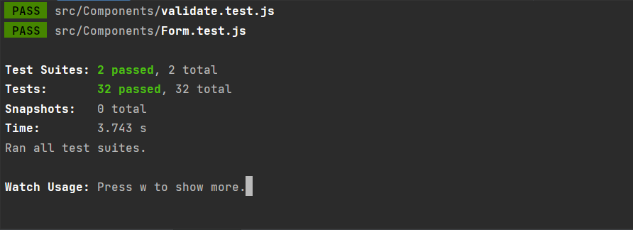
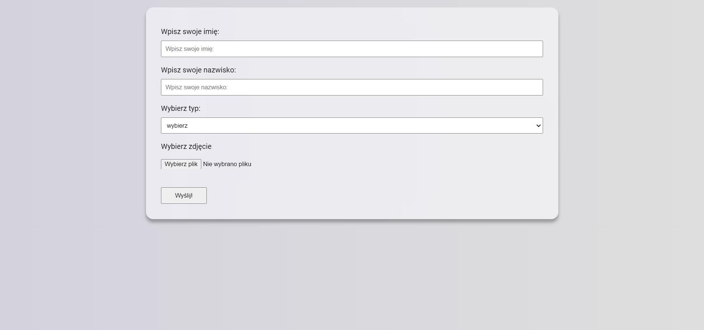
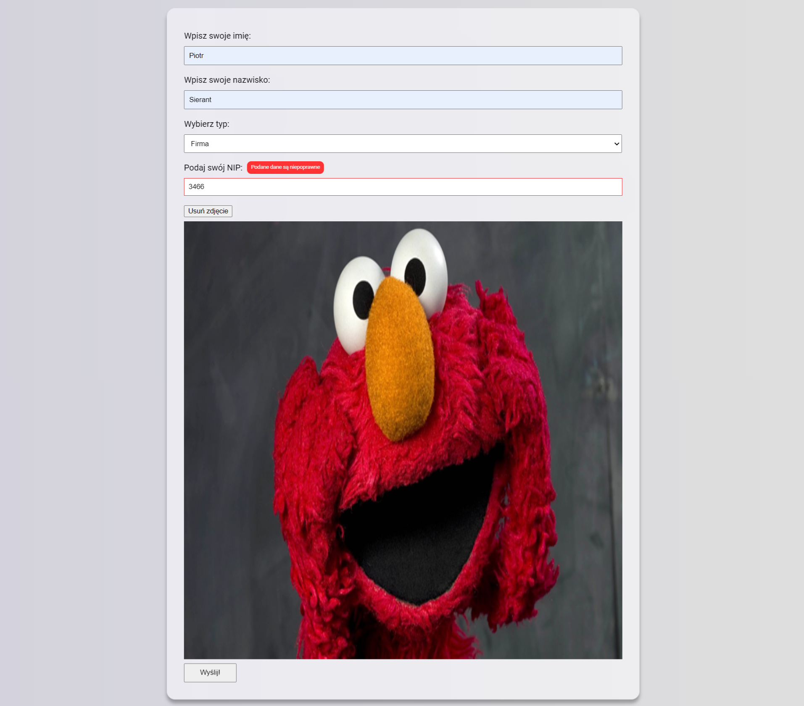
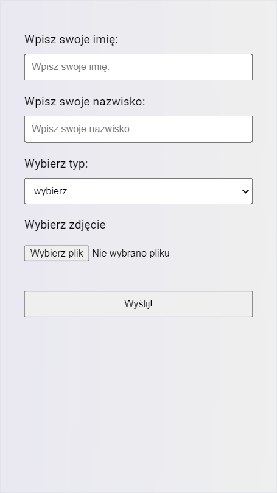
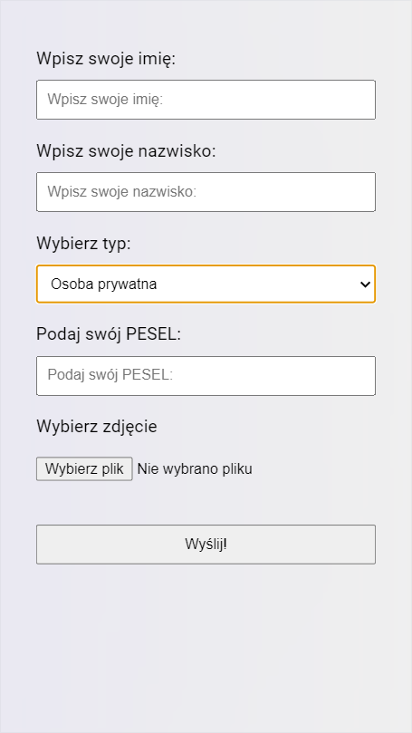
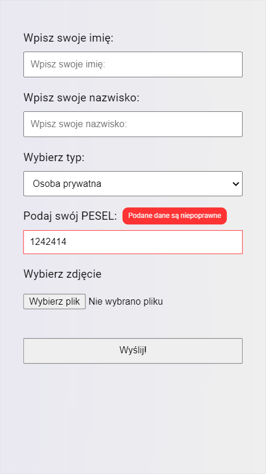
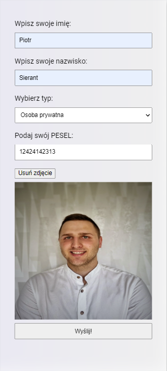
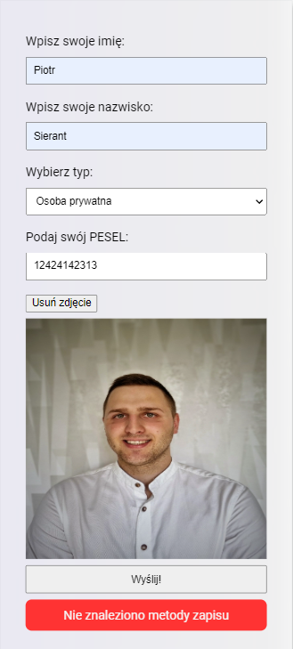

<div align="center">
  <a href="https://github.com/othneildrew/Best-README-Template">
    
  </a>

<h3 align="center">MyMusic - zadanie rekrutacyjne</h3>

  <p align="center">
    <a href="https://piotrsierant.github.io/MyMusicTask/">View Live</a>
  </p>
</div>

## Zadanie rekrutacyjne

Zadanie rekrutacyjne na Junior Frontend Developera. Formularz kontrachenta z odpowiednimi polami, walidacją oraz wysłaniem danych pod wskazany adres.

### Wykonane w:

 
 
 
 


### Testy



### Instalacja

_Poniżej znajduje się przykład instalacji aplikacji._

1. Sklonuj repozytorium
   ```sh
   git clone https://github.com/PiotrSierant/MyMusicTask.git
   ```
2. Zainstaluj pakiety
   ```sh
   npm install
   ```
3. Rozpocznij projekt
   ```sh
   npm start
   ```

## Rzuty ekranu aplikacji








